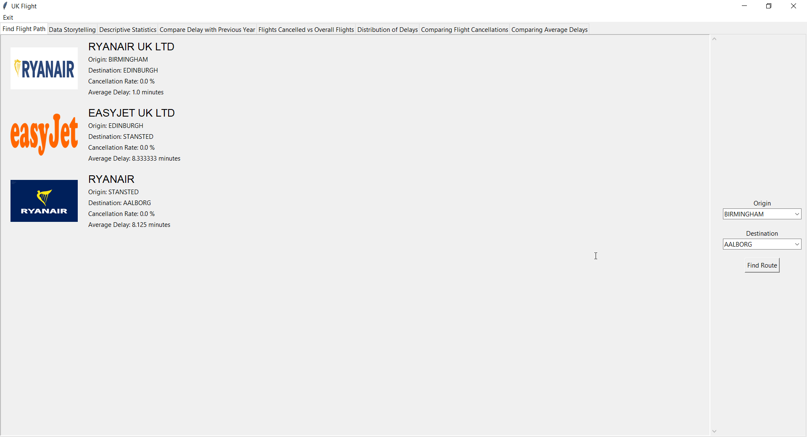

# UK Flight
A program to compute and show statistics of flight routes from the United Kingdom to anywhere in the world. It shows how to go from city A to city B via Air. And check whether a direct flight exists. If not, find the route to city C where the passenger can transfer the flight to city B. As well as statistics on the punctuality of airlines. Users will be able to compare the cancellation rate and average delay of airlines, the delay time distribution, and see the correlation between average delays of this year and the previous year.

## Screenshots

### Data Storytelling Page

### Other pages



## How to install
For more information, including how to set up a virtual environment, please refer to [this wiki page](https://github.com/Jangsoodlor/uk-flight/wiki/Installation-Guide).
0. Have Python 3.11 or newer installed on your machine
1. Clone this repository, or download it as a zip file and extract it. The dataset is already included in `./dataset` directory.
    ```
    git clone https://github.com/Jangsoodlor/uk-flight.git
    ```
2. Navigate to the project's directory
    ```
    cd uk-flight
    ```
3. Install all dependencies required to run the program 
    ```
    pip install -r requirements.txt
    ```

## How to run
1. Install the program as explained in the [How to install](#how-to-install) section.
2. Run the main.py file
    ```
    python main.py
    ```

## References
- [Project Proposal](https://docs.google.com/document/d/1QlqTjomPm1xXTJekI6Y5g-Xd2_wno9aJruF_hKrIFtU/edit#heading=h.s7vi53uqxnxi)
- [Development Plan](https://github.com/Jangsoodlor/uk-flight/wiki/Development-Plan)
- [UML Diagrams](https://github.com/Jangsoodlor/uk-flight/wiki/UML-Diagrams)
- [Data Source](https://www.caa.co.uk/data-and-analysis/uk-aviation-market/flight-punctuality/uk-flight-punctuality-statistics/2024/)
- [Main Wiki Page](https://github.com/Jangsoodlor/uk-flight/wiki)
